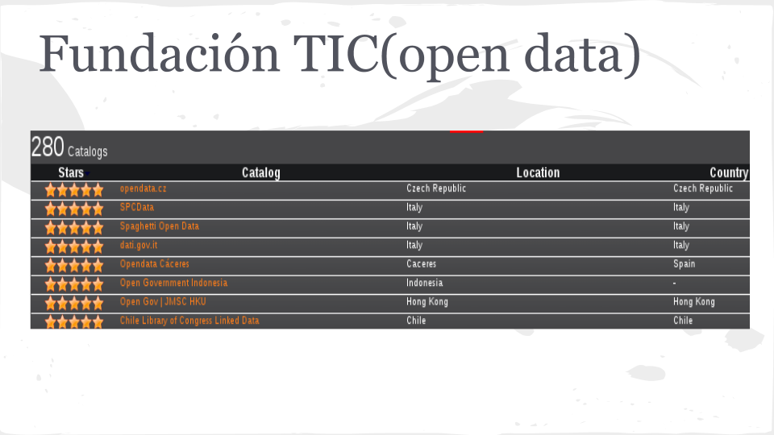
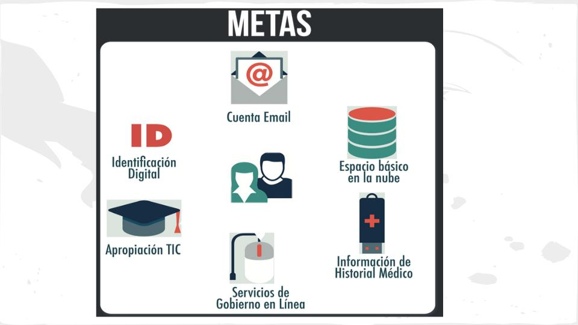

<!-- configuracion de colores es opcional pero ultil-->
<section id="themes">
	<h2>Configuración de temas</h2>
	

		Temas:  
		<a href="?#/themes">Default</a> -
		<a href="?theme=sky#/themes">Sky</a> -
		<a href="?theme=beige#/themes">Beige</a> -
		<a href="?theme=simple#/themes">Simple</a> -
		<a href="?theme=serif#/themes">Serif</a> -
		<a href="?theme=night#/themes">Night</a>  
		<a href="?theme=moon#/themes">Moon</a> -
		<a href="?theme=solarized#/themes">Solarized</a>
	

</section>

Slide:

# Recursos y datos abiertos

Gino Forero

Slide:

# Indice

## PRISM
## OSINT
## Datos Abiertos
## Carpeta Digital Ciudadana

Slide:

# Objetivos

## Principal

+ Hablar un poco sobre la tendencia de los datos abiertos, que manejo se le pretende dar a los datos en colombia y el proyecto PRIM

Slide:

# Los datos
La privacidad es un derecho fundamental, consagrado en DUDH

Slide:
# PRISM
+ El programa PRISM de la Agencia de Seguridad Nacional (NSA), cuya existencia se dio a conocer al público a través de las filtraciones del ex analista de la NSA, Edward Snowden, en 2013, establece la obligación para las empresas tecnológicas de compartir con el gobierno información sobre sus usuarios

Yahoo: “el Gobierno nos amenazó con imponernos una multa diaria de 250.000 dólares si rechazábamos obedecer”

Slide:

# Datos coleccionados por PRISM
+ 2007 microsoft
+ 2008 yahoo
+ 2009 google
+ 2009 paltalk
+ 2010 youtube
+ 2011 skype
+ 2012 apple

Slide:

## «Open Source Intelligence» (OSINT)

Hace referencia al conocimiento recopilado a partir de fuentes de acceso público. El proceso incluye la búsqueda, selección y adquisición de la información, así como un posterior procesado y análisis de la misma con el fin de obtener conocimiento útil y aplicable en distintos ámbitos.

Subslide:

## OSINT
### Usos
+ Conocer la reputación online de un usuario o empresa.
+ Realizar estudios sociológicos, psicológicos, lingüísticos, etc.
+ Auditoria de empresas y diferentes organismos con el fin de evaluar el nivel de privacidad y seguridad.
+ Evaluar tendencias de mercados.
+ Identificación y prevención de posibles amenazas en el ámbito militar o de la seguridad nacional.
+ Como aspecto negativo, es utilizado por cibercriminales para lanzar ataques APT y «Spear Phishing».

Slide:

## ¿Qué son datos abiertos?

Son todos aquellos datos primarios, sin procesar, en formatos estándar e interoperables que facilitan su acceso y permiten su reutilización, los cuales están bajo la custodia de las entidades públicas y que pueden ser obtenidos y ofrecidos sin reserva alguna, de forma libre y sin restricciones, con el fin de que terceros puedan reutilizarlos y crear servicios derivados de los mismos. 

Subslide:

## Ventajas
+ Disponibilidad y acceso
+ Reutilización y redistribución
+ Participación universal: todos deben poder utilizar, reutilizar y re distribuir la información.
+ Mayor legitimidad en las decisiones políticas adoptadas
+ Mejora del funcionamiento interno de las instituciones
+ Solución de los problemas de la representación y la participación en las actuales democracias.

Subslide:

## Datos abiertos
### Ejemplos de uso de datos abiertos

+ En una ciudad de Ohio, se utilizó para ver qué casas tenían acceso al agua. Después, con otros datos, se descubrió que las personas negras no tenían acceso a este bien

+ Se utilizaron datos sobre accidentes de bicicleta fueron utilizados (dos días después de ser abiertos) para hacer un mapa en el que aparecían señalados los puntos donde había tenido lugar un accidente, para poder elegir las rutas más seguras.

+ Proyecto “Where does my mony go?” el cual al introducir el salario anual aproximado, esta base de datos realiza una estimación para mostrar cuánto dinero recaudado mediante impuestos destina el Gobierno británico a diferentes actividades.

Subslide:
##Gobierno abierto Chile

+ Fortalecer las organizaciones de la sociedad civil, promoviendo una cultura de corresponsabilidad.
+ Promover y orientar las acciones de participación ciudadana hacia el mejoramiento de la eficacia, eficiencia y efectividad de las políticas públicas.
+ Fortalecer los canales y espacios de información y opinión de la ciudadanía, promoviendo una respuesta de calidad y oportuna de parte de los órganos de la Administración del Estado.

Subslide:
##Gobierno abierto Perú

En Septiembre del 2011 el Gobierno del Perú manifestó su voluntad de ser parte de la iniciativa “Alianza para el Gobierno Abierto” impulsada por los países de Estados Unidos de América y Brasil, comprometiéndose a aumentar la transparencia sobre las actividades del Estado, apoyar y promover la participación ciudadana, implementar altos estándares de integridad profesional en la gestión pública y a incrementar el acceso y uso de nuevas 
tecnologías (Declaración del Gobierno Abierto, septiembre de 2011).

Subslide:
##Formatos para datos abiertos

+ Una estrella - Disponible en la Internet (en cualquier formato. Por ejemplo: PDF), siempre que sea con licencia abierta, para que sea considerado un Dato Abierto.
+ Dos estrellas - Disponible en la Internet de manera estructurada (en un archivo Excel con extensión XLS).
+ Tres estrellas - Disponible en la Internet de manera estructurada y en formato no propietario (CVS en vez del Excel).
+ Cuatro estrellas - Siguiendo todas las reglas anteriores, pero dentro de los estándares establecidos por el W3C (RDF e SPARQL): usar URL para identificar cosas y propiedades, de manera que las personas las puedan direccionar para sus publicaciones.
+ Cinco estrellas - Todas las reglas ya mencionadas, y además: vincular sus datos a los de otras personas, de manera a proveer un contexto.

Subslide:
##Fundación TIC(open data) 

Subslide:
##El Gobierno Abierto y los Datos Abiertos
+ Busca administraciones más efectivas, transparentes y orientadas a mejorar la calidad de vida de los ciudadanos.

+ Apoyar el progreso económico y social por medio del acceso y uso de la información pública por parte de ciudadanos y empresas, para que sea utilizada o transformada para la generación de servicios de gobierno que generen valor a la sociedad en general.

Subslide:
## ¿Qué tipo de datos se espera publicar?
Todos aquellos que no estén sometidos a reserva de acuerdo con la constitución y la ley. Los datos disponibles tendrán, por tanto, una diversidad considerable que abarcará múltiples sectores o temáticas. 

Subslide:
## Catálogos de datos Abiertos en colombia

###Catálogo de datos abiertos
+ permite encontrar, de manera unificada, todos los datos publicados por las entidades públicas de Colombia, en formato abierto
###BCV Datos abiertos
+ Bogotá Cómo Vamos es una organización que recoge datos estadísticos oficiales sobre calidad de vida y elabora una encuesta de percepción sobre aspectos claves que inciden en la ciudad. 
###Cuentas claras
+ Este portal los candidatos y partidos envían sus reportes financieros de campañas electorales

Subslide:
##Catálogos de datos Abiertos en colombia (Cont...)
###Portal de Transparencia Económica
+ permite hacer consultas sobre gastos e ingresos del Gobierno Nacional y las empresas que contratan con el Estado y los montos de los contratos.
###Parques Nacionales Naturales
+ se pueden descargar datos abiertos con información cartográfica de los límites de los parques, de las reservas de la sociedad civil , etc
###FONADE
+ sobre contratación y datos de contacto de la organización.
###Instituto Nacional de Metrología
+ datos acerca de sus servicios

Slide:

## Datos Personales

Slide:
## Datos Personales en México
el sistema tiene como finalidad la administración y almacenamiento, tanto de los datos personales como de la información sobre quejas, denuncias, felicitaciones, opiniones, peticiones y en general cualquier asunto con el estado.

La Unidad Administrativa responsable del Sistema de datos personales es la Dirección General de Atención Ciudadana. Usted podrá ejercer los derechos de acceso y corrección (rectificación) de sus datos personales, así como aquellos establecidos por la Constitución Política

Subslide:
## Datos personales
###El Plan Vive Digital 2014-2018

Subslide:
## Datos personales
###Carpeta Digital Ciudadana
En 2018 cada colombiano tendrá presencia en Internet lo cual le abrirá las puertas como ciudadano del mundo. Como parte de esto, cada colombiano tendrá un espacio básico en la nube que hará más fácil y eficiente su interacción con el Estado. En este espacio, cada ciudadano podrá tener alojado, de forma ordenada y totalmente gratuita, documentos como su historia clínica, sus certificados y documentos públicos, y sus registros y documentos académicos (en la medida en que estos están disponibles). 
Subslide:
## Datos personales
###Qué son los datos personales?
tus datos personales dicen quién eres; qué cosas te gustan; cuáles son tus capacidades, habilidades o deficiencias; con quién te relacionas; cuáles son tus preferencias; además, revelan información financiera y sobre tu patrimonio, es decir, dicen todo sobre tu persona. 

Subslide:
## Datos personales

Subslide:
## Datos personales
###¿Cómo lo haremos?
Implementación del Proyecto Carpeta Ciudadana a partir de una alianza público-privada

Nota: la parte más compleja será la educación y la difusión del tema para cada colombiano utilice el sistema y lo consulte periódicamente.

Subslide:
## Datos personales
###Seguridad?
Hoy incluso, se duda de la veracidad de documentos digitales, pues los teléfonos inteligentes facilitan que los ciudadanos tengan siempre una foto de su cédula o del registro civil de sus hijos. La parte negativa es que estos son más fácilmente manipulables justamente en una versión digital, y se pueden falsificar con un par de clics.

En cambio, los documentos digitales almacenados en la nube de cada usuario, garantizan y certifican que son legítimos.

El propietario de la información será el ciudadano y cada proveedor de servicio debe garantizar la seguridad y la confidencialidad de la información.
Subslide:
## Datos personales
###Protección de datos personales
Surge en Europa el concepto de la protección de datos personales. Un concepto similar surgió en los Estados Unidos de América --el concepto de “privacidad”-- aunque con alcances distintos. Bajo el concepto de protección de datos personales, el titular (o dueño) de dichos datos es la propia persona, lo que implica la libertad de elegir qué se desea comunicar, cuándo y a quién, manteniendo el control personal sobre la propia información. 

Subslide:
## Datos personales
### Nuevos negocios
Con la creación de las cuentas de correos de ciudadanos se crea na nueva oportunidad de negocio para las empresas TIC. Se adjudicará quién administre este sistema y se evaluarán diferentes modelos de negocio para rentabilizarlo.

Incluir publicidad en la plataforma de la nube personal, ofrecer un servicio Premium por el que se le cobre al usuario por tener espacio adicional en su nube para almacenar y compartir fotos, música, videos o cualquier tipo de archivos, pueden ser dos opciones.
Slide:

# Resources
* [presentacion del plan de gobierno 201-2018](http://www.canal-ec.com/20696-Santos-presento-su-nuevo-plan-para-las-TIC-en-Colombia-.html)
* [vivedigital plan 2014-2018](http://www.vivedigital.gov.co/2014-2018/proposito.php?lg=35)
* [publimetro cada ciudadano tendra un correo y una nube personal](http://www.publimetro.co/lo-ultimo/cada-colombiano-tendra-una-correo-estatal-y-una-nube-personal/lmknio!DzUgXxjssGPJE/)
* [Articulo Semana Cada ciuadadano tendra un email](http://www.semana.com/tecnologia/articulo/cada-colombiano-tendra-un-email-oficial/402110-3)
* [Yahoo denuncia a la NSA](http://www.diariopresente.com.mx/section/acervo/116805/yahoo-denuncia-amenazas-nsa/)
* [Datos Mexico](http://inicio.ifai.org.mx/_catalogs/masterpage/En-Posesion-del-Gobierno.aspx?a=m1)
* [Proteccion de datos Mexico](http://www.presidencia.gob.mx/atencion-ciudadana/proteccion-de-datos-personales/)
* [Plan de Gobierno Abierto Peru](http://www.minjus.gob.pe/wp-content/uploads/2013/04/Plan_Gobierno_Abierto.pdf)
* [Resumen de Datos abiertos en colombia](http://programa.gobiernoenlinea.gov.co/apc-aa-files/da4567033d075590cd3050598756222c/Resumen_Ejecutivo_Datos_Abiertos.pdf)
* [Catalogo de datos abiertos en colombia](http://masinformacionmasderechos.co/portales-con-datos-abiertos-en-colombia)
* [Fundacion tic Datos abierot en el mundo](http://datos.fundacionctic.org/sandbox/catalog/faceted/)
* [Blog OSINT](http://www.inteco.es/blogs/post/Seguridad/BlogSeguridad/Articulo_y_comentarios/osint_la_informacion_es_poder)
* [video datos abiertos peru](https://www.youtube.com/watch?v=yEtMRxaAYLA)